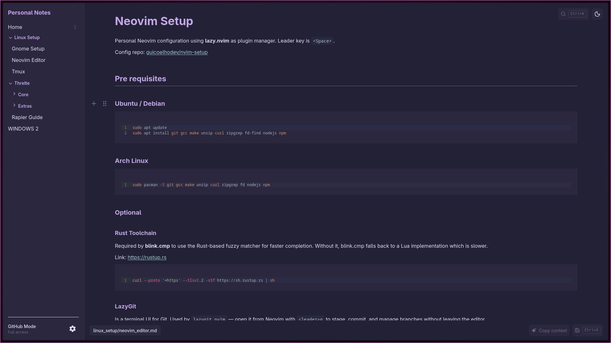
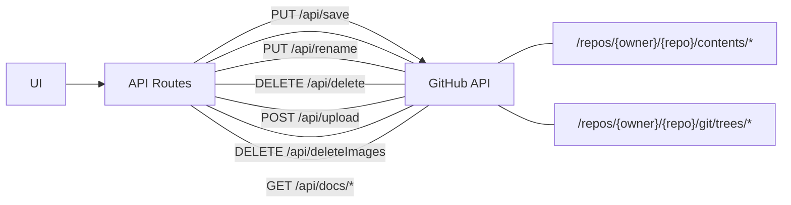

# Personal Notes



*A personal markdown notes editor with full GitHub integration. Write notes in markdown, store them in a GitHub repository, access them anywhere.*

## Table of Contents

- [Features](#features)
- [How It Works](#how-it-works)
- [Prerequisites](#prerequisites)
- [Setup](#setup)
- [Environment Variables](#environment-variables)
- [API Endpoints](#api-endpoints)
- [State Management](#state-management)
- [Theme System](#theme-system)
- [Keyboard Shortcuts](#keyboard-shortcuts)
- [Development](#development)
- [Tech Stack](#tech-stack)

## Features

- **Real-time Markdown Editing** - Milkdown Crepe provides rich text editing with markdown shortcuts
- **GitHub Storage** - All notes stored as markdown files in your GitHub repository's `docs/` folder
- **Image Upload** - Drag-drop or paste images, uploads directly to GitHub (`.github/images/`)
- **Fuzzy Search** - Press `Ctrl+K` to search all notes instantly
- **File Tree Navigation** - Hierarchical sidebar with folders
- **5 Themes** - Catppuccin, Tokyo Night, Gruvbox, Solarized, Rose Pine (each with light/dark variants)
- **Keyboard Shortcuts** - `Ctrl+S` to save, `Ctrl+K` to search
- **Read-only Mode** - Set `PUBLIC_READ_ONLY=true` for local-only development

## How It Works



## Pre requisites

1. **Node.js 18+** and npm
2. **GitHub Personal Access Token (PAT)** with `repo` scope
3. **A GitHub repository** with:
   - A `docs/` folder (for your notes)
   - A `.github/images/` folder (for uploaded images)

### Creating a GitHub PAT

1. Go to GitHub Settings → Developer settings → Personal access tokens → Tokens (classic)
2. Generate a new token with `repo` scope (full control)
3. Copy the token - you won't see it again

## Setup

```bash
# Clone the repository
git clone <your-repo-url>
cd personal_notes/client

# Install dependencies
npm install

# Create environment file
cp .env.example .env

# Edit .env with your credentials (see below)
vim .env

# Start development server
npm run dev
```

Open [http://localhost:5173](http://localhost:5173) in your browser.

## Environment Variables

Create a `.env` file based on `.env.example`:

```bash
# Required - GitHub credentials
GITHUB_TOKEN=ghp_your_personal_access_token_here
GITHUB_OWNER=your-github-username
GITHUB_REPO=your-repo-name
GITHUB_BRANCH=master

# Optional - Read-only mode for local development
PUBLIC_READ_ONLY=false
```

| Variable           | Required | Description                                                 |
| ------------------ | -------- | ----------------------------------------------------------- |
| `GITHUB_TOKEN`     | Yes      | GitHub Personal Access Token with repo scope                |
| `GITHUB_OWNER`     | Yes      | Your GitHub username or organization                        |
| `GITHUB_REPO`      | Yes      | Repository name where notes are stored                      |
| `GITHUB_BRANCH`    | Yes      | Branch name (e.g., `master` or `main`)                      |
| `PUBLIC_READ_ONLY` | No       | Set to `true` to use local `docs/` folder instead of GitHub |

## API Endpoints

| Method   | Endpoint                    | Description                                      |
| -------- | --------------------------- | ------------------------------------------------ |
| `GET`    | `/api/docs`                 | List all documents (returns file tree with SHAs) |
| `GET`    | `/api/docs/[...path]`       | Get specific file content                        |
| `GET`    | `/api/local-docs/[...path]` | Local docs fallback (read-only mode)             |
| `PUT`    | `/api/save?mode=create`     | Create new file                                  |
| `PUT`    | `/api/save`                 | Update existing file                             |
| `DELETE` | `/api/delete`               | Delete file (use `isFolder=true` for folders)    |
| `PUT`    | `/api/rename`               | Rename file or folder                            |
| `POST`   | `/api/upload`               | Upload image (max 5MB)                           |
| `DELETE` | `/api/deleteImages`         | Delete multiple images                           |

## State Management

Uses Svelte 5's runes-based stores (`*.svelte.ts` files):

| Store            | Purpose                                            |
| ---------------- | -------------------------------------------------- |
| **SidebarState** | File tree, active file, loading states             |
| **EditorState**  | Current file, content, save status, dirty tracking |
| **SearchState**  | Fuzzy search using Fuse.js                         |
| **ThemeState**   | Theme selection and light/dark variant             |

## Theme System

Five themes available, each with light and dark variants:

| Theme           | Accent Color   |
| --------------- | -------------- |
| **catppuccin**  | Purple         |
| **tokyo-night** | Blue (default) |
| **gruvbox**     | Red/Orange     |
| **solarized**   | Blue           |
| **rose-pine**   | Pink/Mauve     |

Themes are stored in `src/routes/layout.css` and applied via `data-theme` attribute on `<html>`.

## Keyboard Shortcuts

| Shortcut | Action                |
| -------- | --------------------- |
| `Ctrl+K` | Open fuzzy search     |
| `Ctrl+S` | Save current file     |
| `Escape` | Close modals / Cancel |

## Development

```bash
npm run dev          # Start development server
npm run build        # Build for production
npm run preview      # Preview production build
npm run check        # TypeScript type checking
npm run lint         # Run ESLint and Prettier
npm run format       # Format code with Prettier
```

## Tech Stack

- **Frontend**: SvelteKit with Svelte 5 (runes mode)
- **Language**: TypeScript
- **Styling**: TailwindCSS v4
- **Editor**: Milkdown Crepe (markdown)
- **Search**: Fuse.js (fuzzy search)
- **Icons**: Custom SVG components
- **Storage**: GitHub Repository (via GitHub Contents API)
